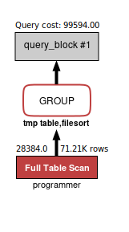

# B. 인덱스 설계

## Coding as Hobby

create index hobby_idx on programmer(hobby);  

select hobby, count(*) / (select count(*) from programmer) "Coding as a Hobby" from programmer group by hobby;  

  
  

## 각 프로그래머별로 해당하는 병원 이름을 반환하세요

create index idx_hospital on hospital(id);  
create index idx_covid on covid(programmer_id, hospital_id);  

select covid.programmer_id, hospital.name from covid, hospital where covid.hospital_id = hospital.id;  

  
  

## 프로그래밍이 취미인 학생 혹은 주니어(0~2년)들이 다닌 병원 이름을 반환하고 user.id 기준으로 정렬하세요.  

create index idx_hospital on hospital(id);  
create index idx_covid on covid(programmer_id, hospital_id);  
create index idx_programmer on programmer(hobby, years_coding);  

select d.id, h.name, d.hobby, d.dev_type, d.years_coding from  
(select p.id, p.hobby, p.dev_type, p.years_coding from programmer p where p.hobby = "yes" or p.years_coding = "0-2 year" order by id) d,  
(select covid.programmer_id id, hospital.name name from covid, hospital where covid.hospital_id = hospital.id) h where d.id = h.id;  

  
  

## 서울대병원에 다닌 20대 India 환자들을 병원에 머문 기간별로 집계하세요.
이 부분에서는 Index에 대해서 많이 고민을 하였던 것 같아요.  
왜냐하면 Text는 index로 사용을 할 수 없다고 안내를 받았습니다.  
그 때문에 [sql-server-index-on-text-column](https://stackoverflow.com/questions/830241/sql-server-index-on-text-column)라는 글의 도움을 받아,   Text들을 varchar(255)로 형태로 DB를 수정한 다음 Index를 만들어 실행하게 되었습니다.  
또한, 여기서부터 성능 개선이 잘 되지 않아서, 서브 쿼리 대신에 join을 적극적으로 사용하게 되었습니다.  

alter table hospital modify name VARCHAR(255);  
create index idx_hospital on hospital(id);  
create index idx_covid on covid(programmer_id, hospital_id);  
create index idx_programmer on programmer(country, member_id, id);  
create index idx_member on member(age, id);  

select h.stay, count(*) from  
(select p.id, p.country from programmer p join member as m on m.id = p.member_id where m.age between 20 and 29 and p.country ="India") d,  
(select c.programmer_id id, hp.name, c.stay stay from covid c join hospital as hp on c.hospital_id = hp.id where hp.name= "서울대병원") h  
where d.id = h.id group by h.stay;  

  
  

## 서울대 병원에 다닌 30대 환자들을 운동 횟수별로 집계하세요 .
alter table programmer modify exercise varchar(255);  
create index idx_hospital on hospital(name, id);  
create index idx_covid on covid(programmer_id, hospital_id);  
create index idx_programmer on programmer(member_id, id, exercise);  
create index idx_member on member(age, id);  

select d.exercise, count(*) from  
(select m.id, p.exercise from programmer p  
join (select id from member where age between 30 and 39) as m on m.id = p.member_id) d  
join (select c.member_id id, c.stay stay from covid c, (select id from hospital where name = "서울대병원") h  
where c.hospital_id = h.id) hp on d.id = hp.id group by d.exercise;  

  
  
