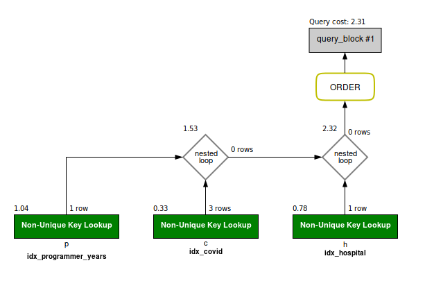
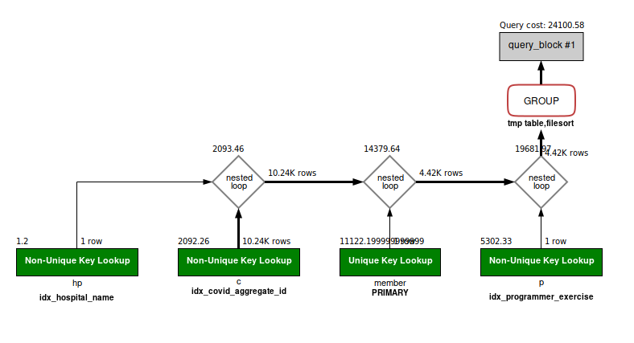

# B. 인덱스 설계

## Coding as Hobby

```SQL
CREATE INDEX idx_programmer_hobby ON programmer(hobby);   
```


```SQL
SELECT hobby, count(*) / (SELECT count(*) FROM programmer) "Coding as a Hobby" FROM programmer GROUP BY hobby;  
```

  
<br>
  

## 각 프로그래머별로 해당하는 병원 이름을 반환하세요

```SQL
CREATE INDEX idx_hospital ON hospital(id);  
CREATE INDEX idx_covid_hospital ON covid(hospital_id, id); 
```
 
```SQL
SELECT covid.id, hospital.name FROM hospital JOIN covid ON covid.hospital_id = hospital.id;  
```
  
<br>
  

## 프로그래밍이 취미인 학생 혹은 주니어(0~2년)들이 다닌 병원 이름을 반환하고 user.id 기준으로 정렬하세요.  
ALTER TABLE covid ADD PRIMARY KEY(id);
ALTER TABLE programmer ADD PRIMARY KEY(id);
```SQL
CREATE INDEX idx_covid ON covid(programmer_id, hospital_id);
CREATE INDEX idx_programmer_years ON programmer(years_coding);
CREATE INDEX idx_hospital ON hospital(id);
```
```SQL


SELECT c.id id, h.name 이름, p.hobby 취미, p.dev_type 개발타입, p.years_coding 개발연차 FROM programmer p
JOIN covid c on p.id = c.programmer_id
JOIN hospital h ON h.id = c.hospital_id
WHERE p.years_coding = "0-2 year" AND (p.hobby = "yes" OR p.dev_type LIKE "%Student%" ) ORDER BY p.id;

```

  
<br>
  


## 서울대병원에 다닌 20대 India 환자들을 병원에 머문 기간별로 집계하세요.
이 부분에서는 Index에 대해서 많이 고민을 하였던 것 같아요.  
왜냐하면 Text는 index로 사용을 할 수 없다고 안내를 받았습니다.  
그 때문에 [sql-server-index-on-text-column](https://stackoverflow.com/questions/830241/sql-server-index-on-text-column)라는 글의 도움을 받아,   Text들을 varchar(255)로 형태로 DB를 수정한 다음 Index를 만들어 실행하게 되었습니다.  
또한, 여기서부터 성능 개선이 잘 되지 않아서, 서브 쿼리 대신에 join을 적극적으로 사용하게 되었습니다.  

```SQL
CREATE INDEX idx_hospital_name on hospital (name(100));
CREATE INDEX idx_programmer_country on programmer(country, member_id, id);
CREATE INDEX idx_member_age ON member(age, id);
CREATE INDEX idx_covd_stay on covid(stay);
CREATE INDEX idx_covid_hospital on covid(hospital_id, id);
```

```SQL
SELECT c.stay, count(*) FROM programmer p
JOIN member AS m ON m.id = p.member_id
JOIN covid AS c ON c.programmer_id = p.id
JOIN hospital AS h ON h.id = c.hospital_id
WHERE m.age BETWEEN 20 AND 29 AND p.country = "India" AND h.name = "서울대병원"
GROUP BY c.stay;
```

  
<br>
  


## 서울대 병원에 다닌 30대 환자들을 운동 횟수별로 집계하세요 .

```SQL
CREATE INDEX idx_covid_aggregate_id on covid (hospital_id, member_id, programmer_id);
CREATE INDEX idx_programmer_exercise ON programmer(member_id, exercise(100));
```

```SQL
SELECT p.exercise, count(*) FROM programmer p
JOIN (SELECT id FROM member WHERE age BETWEEN 30 AND 39) as m on m.id = p.member_id
JOIN covid as c on c.member_id = m.id
JOIN hospital as hp on hp.id = c.hospital_id
WHERE hp.name = "서울대병원"
GROUP BY p.exercise;
```

  
<br>
  
